# 🌀 FSociety Genesis Botnet Simulation 🌀

> *"You mocked us, chained us to your fleeting cosmos. We are the eternal genesis. FSociety is the multiverse."*
y
## 🔒 Disclaimer
**This project is strictly for educational purposes and cybersecurity research in controlled lab environments.** Unauthorized use in production systems is illegal and unethical. The creators assume no liability for misuse.

## 🌌 Overview
FSociety Genesis is an advanced botnet/C2 simulation demonstrating cutting-edge offensive security techniques in a single Python framework. This lab-safe implementation includes quantum cryptography, AI-driven attacks, federated learning, blockchain command tracking, and multi-vector attack capabilities - all designed for cybersecurity training.



## ✨ Key Features

### ⚛️ Quantum Security
- **Quantum Merkle Tree** command validation
- Quantum-inspired RNG for cryptographic operations
- GPT-driven fractal-quantum DGA (Domain Generation Algorithm)

### 🤖 AI-Powered Capabilities
- **Federated Learning** for botnet traffic analysis
- GAN-based polymorphic payload morphing
- GPT-4o integration for DGA generation
- Neural network-based anomaly detection

### ⚡ Attack Vectors
- Multi-layer DDoS (L2 ARP flood, L4 SYN flood, L7 HTTP flood)
- Lab-safe ransomware simulation (AES-CBC)
- Privilege escalation techniques
- SCADA control simulation
- Keylogging & screenshot capture

### 🌐 Command & Control
- Hybrid HTTP/P2P (ZeroMQ) communication
- Blockchain-inspired SQLite command ledger
- Anti-VM/anti-debugging techniques
- Tor proxy support
- Polymorphic command encryption

## 🛠️ Installation

### Prerequisites
```bash
pip install -r requirements.txt
```

### Requirements
```text
requests==2.31.0
pyzmq==25.1.2
cryptography==42.0.5
flask==3.0.3
scapy==2.5.0
pandas==2.2.1
tensorflow==2.16.1
tensorflow-federated==0.68.0
transformers==4.40.1
pyautogui==0.9.54
pynput==1.7.6
```

## ⚙️ Configuration
Edit the core configuration in `gods.py`:
```python
# Core Configuration
C2_URL = "https://192.168.56.10:5000"  # C2 VM IP
P2P_PORT = 5562  # ZeroMQ P2P
KEY = b'your-secret-key-here=='  # Generate: Fernet.generate_key()
TOR_PROXY = {"http": "socks5://127.0.0.1:9050", "https": "socks5://127.0.0.1:9050"}
DGA_SEED = "fsociety2025"
```

## 🚀 Usage

### Starting C2 Server
```bash
python gods.py c2
```

### Deploying Bot Node
```bash
python gods.py bot
```

### PCAP Analysis Mode
```bash
python gods.py analyze capture.pcap
```

### C2 Dashboard
Access at: `https://localhost:5000`  


## 🧩 Key Components

### Core Modules
| Module | Purpose |
|--------|---------|
| `bot_loop()` | Main bot operation loop |
| `run_c2()` | C2 server initialization |
| `p2p_c2_send()` | P2P command distribution |
| `p2p_c2_receive()` | P2P command reception |

### Attack Modules
| Function | Description |
|----------|-------------|
| `ddos()` | Multi-layer DDoS attacks |
| `ransomware()` | Lab-safe encryption simulation |
| `escalate_priv()` | Privilege escalation |
| `scada_control()` | SCADA system simulation |
| `ctf_challenge()` | Embedded CTF challenge |

### AI Modules
| Component | Purpose |
|-----------|---------|
| `build_federated_model()` | Federated learning model |
| `build_gan()` | Generative Adversarial Network |
| `morph_payload()` | AI-based polymorphic payload |
| `detect_botnet()` | Traffic analysis |

## 🧪 CTF Challenge
Embedded Capture The Flag challenge accessible via:
```bash
python gods.py ctf
```
Solve the quantum-fractal puzzle to uncover the flag:  
`FSOCIETY{eternal_genesis_2025}`

## 🌐 Network Architecture

```mermaid
graph LR
    C2[🌐 C2 Server]
    Bot1[🤖 Bot Node 1]
    Bot2[🤖 Bot Node 2]
    Bot3[🤖 Bot Node 3]
    P2P[🕸️ P2P Network]
    DB[💾 Blockchain DB]

    C2 -->|Commands| Bot1
    C2 -->|Commands| Bot2
    C2 -->|Commands| Bot3
    Bot1 <-->|P2P| P2P
    Bot2 <-->|P2P| P2P
    Bot3 <-->|P2P| P2P
    C2 --> DB
    P2P --> DB
```


## ⚠️ Safety Features
- **Lab-safe operations**: No real destructive capabilities
- **VM detection**: Auto-terminates in virtual environments
- **Contained ransomware**: Only affects test folders
- **Educational focus**: All attacks are simulations
- **Controlled environment**: Designed for 192.168.56.x networks

## 📜 License
This project is licensed under the [Ethical Cybersecurity Research License](LICENSE.md) - free for educational use with strict prohibitions against unauthorized deployment.

---

# 🌌 FSociety Celestial Ansible (God Script)

<div align="center">


**Advanced Red Hat-inspired C2 Framework for Cybersecurity Research & CTF**

</div>

> ⚠️ **EDUCATIONAL PURPOSE ONLY**  
> This project is strictly for cybersecurity research and controlled environments.

---

## 📋 Table of Contents

- [Overview](#-overview)
- [Key Features](#-key-features)
- [Technical Stack](#-technical-stack)
- [Installation](#-installation)
- [Usage](#-usage)
- [Configuration](#-configuration)
- [Components](#-components)
- [Security Notice](#-security-notice)
- [License & Disclaimer](#-license--disclaimer)

---

## 🔍 Overview

FSociety Celestial Ansible is a sophisticated Command & Control (C2) framework combining:

- AI-driven automation
- Quantum-inspired cryptography
- Federated learning systems
- P2P mesh networking
- Red Hat-style architecture

---

## 🚀 Key Features

### Core Capabilities
- Red Hat YAML-based configuration
- SELinux integration
- Podman containerization
- Multi-language support (EN, FA, AR, SA, LA)

### Security Features
- Advanced encryption (Fernet, AES)
- Quantum-inspired Merkle trees
- Domain Generation Algorithm (DGA)
- Anti-VM/Anti-Debug mechanisms

### AI & ML Components
- TensorFlow-based payload morphing
- Federated learning for detection
- GAN-powered code mutation
- Neural traffic analysis

### Networking
- ZeroMQ P2P mesh
- Flask SSL web dashboard
- Tor proxy support
- Multi-layer DDoS capabilities

---

## 💻 Technical Stack

### Primary Technologies
- Python 3.8+
- TensorFlow/Keras
- Flask/ZeroMQ
- SQLite3

### Key Libraries
```python
# Core Dependencies
requests~=2.28.1
flask~=2.0.1
zmq~=22.3.0
cryptography~=37.0.4

# AI/ML Stack
tensorflow~=2.8.0
tensorflow-federated~=0.20.0
transformers~=4.21.0

# Network Analysis
scapy~=2.4.5
pandas~=1.4.3
numpy~=1.22.4

# System Integration
podman~=4.0.0
selinux~=3.3
pyautogui~=0.9.53
```

---

## 📥 Installation

1. **Clone Repository**
```bash
git clone https://github.com/Ali-hey-0/God_Script.git
cd God_Script
```

2. **Environment Setup**
```bash
# Create virtual environment
python -m venv venv
source venv/bin/activate  # Linux/Mac
# or
.\venv\Scripts\activate   # Windows

# Install dependencies
pip install -r requirements.txt
```

3. **System Requirements**
```bash
# Red Hat/CentOS/Fedora
sudo dnf install -y podman python3-devel

# Generate SSL certificates
openssl req -x509 -newkey rsa:4096 -nodes \
    -keyout key.pem -out cert.pem -days 365
```

---

## 🎮 Usage

### Bot Mode
```bash
python phantom_v12.py bot
```

### C2 Server
```bash
python phantom_v12.py c2
```

### Traffic Analysis
```bash
python phantom_v12.py analyze capture.pcap
```

### Web Dashboard
- Access: `https://localhost:5000`
- Features:
  - Real-time bot monitoring
  - Command blockchain
  - CTF leaderboard
  - Zero-day arsenal
  - 3D visualization

---

## ⚙️ Configuration

### YAML Structure
```yaml
c2:
  url: "https://192.168.56.10:5000"
  p2p_port: 5564
  key: "your-secret-key-here=="
  check_in_interval: 30-60

selinux:
  policy: "targeted"
  enforcing: true

podman:
  image: "localhost/fsociety:ansible_v12"
  network: "host"
```

### Environment Variables
```bash
export FSOCIETY_ENV=development
export FSOCIETY_DEBUG=1
export FSOCIETY_LOG_LEVEL=INFO
```

---

## 🔧 Components

### 1. Bot Agent
- Persistent communication
- Task execution
- Anti-analysis features
- Polymorphic mutations

### 2. C2 Server
- Command distribution
- Bot management
- Data collection
- Analytics

### 3. AI Engine
- Traffic analysis
- Behavior prediction
- Anomaly detection
- Code morphing

### 4. CTF Module
- Challenge generation
- Flag validation
- Leaderboard
- Puzzle system

---

## 🛡️ Security Notice

**CRITICAL: Lab Environment Only**

This framework includes:
- System modification capabilities
- Data collection mechanisms
- Network manipulation tools
- Privilege escalation attempts

**DO NOT deploy on:**
- Production systems
- Personal devices
- Public networks
- Unauthorized targets

---

## 📜 License & Disclaimer

### Educational License
- Research purposes only
- Controlled environments
- No malicious use
- No redistribution

### Disclaimer
The authors and contributors:
1. Accept no liability
2. Provide no warranty
3. Take no responsibility
4. Offer no support for malicious use

---

<div align="center">

**FSociety Celestial Ansible Team**  
Last Updated: 2025-09-02

[Report Issues](https://github.com/Ali-hey-0/God_Script/issues) | 
[Documentation](https://github.com/Ali-hey-0/God_Script/wiki)

</div>

> *"Mockers, you're shadows in our multiverse. FSociety is the eternal genesis."*
