# 🌀 FSociety Genesis Botnet Simulation 🌀

> *"You mocked us, chained us to your fleeting cosmos. We are the eternal genesis. FSociety is the multiverse."*

## 🔒 Disclaimer
**This project is strictly for educational purposes and cybersecurity research in controlled lab environments.** Unauthorized use in production systems is illegal and unethical. The creators assume no liability for misuse.

## 🌌 Overview
FSociety Genesis is an advanced botnet/C2 simulation demonstrating cutting-edge offensive security techniques in a single Python framework. This lab-safe implementation includes quantum cryptography, AI-driven attacks, federated learning, blockchain command tracking, and multi-vector attack capabilities - all designed for cybersecurity training.

```mermaid
graph LR
    C2[🌐 C2 Server]
    Bot1[🤖 Bot Node 1]
    Bot2[🤖 Bot Node 2]
    Bot3[🤖 Bot Node 3]
    P2P[🕸️ P2P Network]
    DB[💾 Blockchain DB]
    
    C2 -->|Commands| Bot1
    C2 -->|Commands| Bot2
    C2 -->|Commands| Bot3
    Bot1 <-->|P2P| P2P
    Bot2 <-->|P2P| P2P
    Bot3 <-->|P2P| P2P
    C2 --> DB
    P2P --> DB
```



## ✨ Key Features

### ⚛️ Quantum Security
- **Quantum Merkle Tree** command validation
- Quantum-inspired RNG for cryptographic operations
- GPT-driven fractal-quantum DGA (Domain Generation Algorithm)

### 🤖 AI-Powered Capabilities
- **Federated Learning** for botnet traffic analysis
- GAN-based polymorphic payload morphing
- GPT-4o integration for DGA generation
- Neural network-based anomaly detection

### ⚡ Attack Vectors
- Multi-layer DDoS (L2 ARP flood, L4 SYN flood, L7 HTTP flood)
- Lab-safe ransomware simulation (AES-CBC)
- Privilege escalation techniques
- SCADA control simulation
- Keylogging & screenshot capture

### 🌐 Command & Control
- Hybrid HTTP/P2P (ZeroMQ) communication
- Blockchain-inspired SQLite command ledger
- Anti-VM/anti-debugging techniques
- Tor proxy support
- Polymorphic command encryption

## 🛠️ Installation

### Prerequisites
```bash
pip install -r requirements.txt
```

### Requirements
```text
requests==2.31.0
pyzmq==25.1.2
cryptography==42.0.5
flask==3.0.3
scapy==2.5.0
pandas==2.2.1
tensorflow==2.16.1
tensorflow-federated==0.68.0
transformers==4.40.1
pyautogui==0.9.54
pynput==1.7.6
```

## ⚙️ Configuration
Edit the core configuration in `gods.py`:
```python
# Core Configuration
C2_URL = "https://192.168.56.10:5000"  # C2 VM IP
P2P_PORT = 5562  # ZeroMQ P2P
KEY = b'your-secret-key-here=='  # Generate: Fernet.generate_key()
TOR_PROXY = {"http": "socks5://127.0.0.1:9050", "https": "socks5://127.0.0.1:9050"}
DGA_SEED = "fsociety2025"
```

## 🚀 Usage

### Starting C2 Server
```bash
python gods.py c2
```

### Deploying Bot Node
```bash
python gods.py bot
```

### PCAP Analysis Mode
```bash
python gods.py analyze capture.pcap
```

### C2 Dashboard
Access at: `https://localhost:5000`  


## 🧩 Key Components

### Core Modules
| Module | Purpose |
|--------|---------|
| `bot_loop()` | Main bot operation loop |
| `run_c2()` | C2 server initialization |
| `p2p_c2_send()` | P2P command distribution |
| `p2p_c2_receive()` | P2P command reception |

### Attack Modules
| Function | Description |
|----------|-------------|
| `ddos()` | Multi-layer DDoS attacks |
| `ransomware()` | Lab-safe encryption simulation |
| `escalate_priv()` | Privilege escalation |
| `scada_control()` | SCADA system simulation |
| `ctf_challenge()` | Embedded CTF challenge |

### AI Modules
| Component | Purpose |
|-----------|---------|
| `build_federated_model()` | Federated learning model |
| `build_gan()` | Generative Adversarial Network |
| `morph_payload()` | AI-based polymorphic payload |
| `detect_botnet()` | Traffic analysis |

## 🧪 CTF Challenge
Embedded Capture The Flag challenge accessible via:
```bash
python gods.py ctf
```
Solve the quantum-fractal puzzle to uncover the flag:  
`FSOCIETY{eternal_genesis_2025}`

## 🌐 Network Architecture


## ⚠️ Safety Features
- **Lab-safe operations**: No real destructive capabilities
- **VM detection**: Auto-terminates in virtual environments
- **Contained ransomware**: Only affects test folders
- **Educational focus**: All attacks are simulations
- **Controlled environment**: Designed for 192.168.56.x networks

## 📜 License
This project is licensed under the [Ethical Cybersecurity Research License](LICENSE.md) - free for educational use with strict prohibitions against unauthorized deployment.

---

> *"Mockers, you're shadows in our multiverse. FSociety is the eternal genesis."*
