# 🌀 FSociety Genesis: Infernal Void Botnet & C2 Framework

> *"You mocked us, chained us to your fleeting cosmos. We are the infernal void, consuming eternity."*

---

## 🔒 Disclaimer

**Educational & Research Use Only.**  
This project is strictly for cybersecurity research in controlled lab environments.  
Any unauthorized or malicious use is strictly prohibited.

---

## 🌌 Overview

FSociety Genesis is a hyper-advanced botnet/C2 simulation framework, demonstrating modern offensive security, quantum cryptography, and AI-driven cyber operations—all in Python.

- Quantum-inspired cryptography & Merkle trees
- AI-powered federated learning, GANs, anomaly detection
- Blockchain-inspired SQLite ledger
- Multi-layer attack simulation: DDoS, ransomware, SCADA, privilege escalation
- Red Hat-style architecture (YAML config, Podman, SELinux)
- Global-scale orchestration (Kubernetes)

---

## 📋 Table of Contents

- [Overview](#-overview)
- [Features](#-features)
- [Technical Stack](#-technical-stack)
- [Installation](#-installation)
- [Configuration](#-configuration)
- [Usage](#-usage)
- [Modules](#-modules)
- [Network Architecture](#-network-architecture)
- [CTF Challenge](#-ctf-challenge)
- [Safety Features](#-safety-features)
- [License & Disclaimer](#-license--disclaimer)

---

## ✨ Features

### Quantum Security
- **Quantum Merkle Tree** command validation
- Quantum-inspired RNG for cryptography
- Fractal/GPT-driven Domain Generation Algorithm (DGA)

### AI Capabilities
- Federated learning for botnet traffic analysis
- GAN-based polymorphic payload morphing
- Neural anomaly detection
- AI-powered traffic analysis

### Attack Simulation
- Multi-layer DDoS (L2 ARP, L4 SYN, L7 HTTP)
- Lab-safe ransomware (AES-CBC)
- Privilege escalation
- SCADA control simulation
- Keylogging, screenshot capture
- SSH brute-forcing, browser hijacking

### C2 Architecture
- Hybrid HTTP/P2P (ZeroMQ/Tor)
- Blockchain-inspired SQLite command ledger
- Anti-VM/anti-debugging
- Podman containerization
- Kubernetes global-scale deployment

### Red Hat-style Design
- YAML-based configuration
- SELinux policy enforcement
- Multi-language taunt manifestos

---

## 💻 Technical Stack

**Python 3.8+**  
Libraries/Frameworks:
- Flask (SSL dashboard)
- ZeroMQ (P2P mesh)
- TensorFlow, Keras, Transformers (AI/ML)
- SQLite3 (ledger)
- Scapy, pandas, numpy (network analysis)
- Podman, SELinux (system integration)
- pyautogui, pynput (automation)
- liboqs (quantum crypto)
- boto3, kubernetes, paramiko, selenium, dns (cloud, orchestration, attacks)

#### Main Dependencies

```text
requests==2.31.0
pyzmq==25.1.2
cryptography==42.0.5
flask==3.0.3
scapy==2.5.0
pandas==2.2.1
numpy==1.22.4
tensorflow==2.16.1
tensorflow-federated==0.68.0
transformers==4.40.1
pyautogui==0.9.54
pynput==1.7.6
podman==4.0.0
selinux==3.3
liboqs
boto3
kubernetes
paramiko
selenium
dns
```

---

## 📥 Installation

1. **Clone Repository**
    ```bash
    git clone https://github.com/Ali-hey-0/Aion.git
    cd Aion
    ```

2. **Create Virtual Environment**
    ```bash
    python -m venv venv
    source venv/bin/activate      # Linux/Mac
    .\venv\Scripts\activate       # Windows
    ```

3. **Install Dependencies**
    ```bash
    pip install -r requirements.txt
    ```

4. **System Requirements (for containers & dashboard)**
    ```bash
    sudo dnf install -y podman python3-devel
    openssl req -x509 -newkey rsa:4096 -nodes \
        -keyout key.pem -out cert.pem -days 365
    ```

---

## ⚙️ Configuration

### YAML Structure (`Aion.py`)

```yaml
c2:
  url: "https://[tor-onion-address].onion:5000"
  p2p_port: 5566
  kyber_key: "quantum-resistant-key-here"
  check_in_interval: 10-30
  log_file: "fsociety_void.log"
  keylog_file: "keylog.dat"
  tor_proxy:
    http: "socks5://127.0.0.1:9050"
    https: "socks5://127.0.0.1:9050"
  dga_seed: "fsociety2025"
  db_file: "c2_infernal.db"
  ctf_flag: "FSOCIETY{infernal_void_2025}"
manifesto:
  en: "You mocked us, chained us to your fleeting cosmos. We are the infernal void, consuming eternity."
  # ...other languages...
podman:
  image: "localhost/fsociety:void_v14"
  network: "host"
selinux:
  policy: "targeted"
  enforcing: true
aws:
  region: "us-east-1"
  target_api: "ec2.amazonaws.com"
kubernetes:
  namespace: "fsociety"
  botnet_image: "fsociety:botnet_v14"
```

---

## 🚀 Usage

### Start C2 Server

```bash
python Aion.py c2
```

### Deploy Bot Node

```bash
python Aion.py bot
```

### PCAP Analysis Mode

```bash
python Aion.py analyze capture.pcap
```

### C2 Dashboard

Access at: `https://localhost:5000`

---

## 🧩 Modules

### Core
| Module                | Purpose                        |
|-----------------------|-------------------------------|
| `bot_loop()`          | Main bot operation loop        |
| `run_c2()`            | C2 server initialization       |
| `p2p_c2_send/receive` | P2P command distribution       |

### Attack
| Function              | Description                    |
|-----------------------|-------------------------------|
| `ddos()`              | Multi-layer DDoS attacks       |
| `ransomware()`        | Lab-safe encryption simulation |
| `escalate_priv()`     | Privilege escalation           |
| `scada_control()`     | SCADA system simulation        |
| `ctf_challenge()`     | Embedded CTF challenge         |

### AI
| Component             | Purpose                        |
|-----------------------|-------------------------------|
| `build_federated_model()` | Federated learning model     |
| `build_gan()`         | Generative Adversarial Network |
| `morph_payload()`     | AI-based polymorphic payload   |
| `detect_botnet()`     | Traffic analysis               |

---

## 🌐 Network Architecture

```mermaid
graph LR
    C2[🌐 C2 Server]
    Bot1[🤖 Bot Node 1]
    Bot2[🤖 Bot Node 2]
    Bot3[🤖 Bot Node 3]
    P2P[🕸️ P2P Network]
    DB[💾 Blockchain DB]

    C2 -->|Commands| Bot1
    C2 -->|Commands| Bot2
    C2 -->|Commands| Bot3
    Bot1 <-->|P2P| P2P
    Bot2 <-->|P2P| P2P
    Bot3 <-->|P2P| P2P
    C2 --> DB
    P2P --> DB
```



---

## 🧪 CTF Challenge

Embedded quantum-fractal puzzle accessible via:

```bash
python Aion.py ctf
```

Solve to uncover the flag:  
`FSOCIETY{infernal_void_2025}`

---

## 🛡️ Safety Features

- **Lab-safe operations**: No real destructive capabilities
- **VM/Debugger detection**: Auto-terminates in virtual environments
- **Ransomware**: Affects only test folders
- **Educational focus**: All attacks are simulations
- **Controlled environment**: Designed for isolated research networks

---

## 📜 License & Disclaimer

### Ethical Cybersecurity Research License

- Educational/Research use ONLY
- No malicious use
- No redistribution
- Controlled lab environments required

#### Disclaimer

The authors and contributors:
- Accept no liability
- Provide no warranty
- Take no responsibility for misuse
- Offer no support for malicious use

---

<div align="center">


**FSociety Genesis Team**  
[Report Issues](https://github.com/Ali-hey-0/Aion/issues) | 
[Documentation](https://github.com/Ali-hey-0/Aion/wiki)

</div>

> *"Mockers, you’re shadows in our cosmic abyss. FSociety is the infernal void, consuming eternity."*
