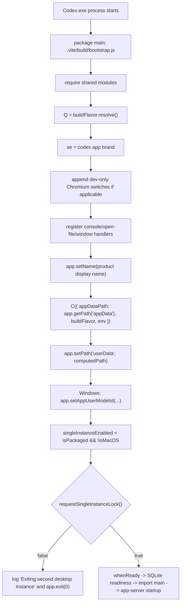

# Codex Desktop Electron userData Trace

Date: 2026-06-29

Scope: reverse engineer how Codex Desktop computes `app.getPath("userData")` before `requestSingleInstanceLock()` runs.

Production code changes: none.

Inspected package:

- `C:\Program Files\WindowsApps\OpenAI.Codex_26.623.8305.0_x64__2p2nqsd0c76g0\app\resources\app.asar`
- `app.asar!package.json`
- `app.asar!.vite/build/bootstrap.js`
- `app.asar!.vite/build/file-based-logger-DZ6052-3.js`
- `app.asar!.vite/build/src-CoIhwwHr.js`
- `app.asar!.vite/build/workspace-root-drop-handler-DeLi4ACJ.js`
- `app.asar!.vite/build/main-B6QfY4LN.js`

## Result

Codex Desktop does not copy `--user-data-dir` into Electron's `userData` path before `requestSingleInstanceLock()`.

The pre-lock Electron `userData` path is computed in `bootstrap.js` by:

1. Reading `process.env.CODEX_ELECTRON_USER_DATA_PATH`.
2. If present and non-empty, resolving that path and using it as Electron `userData`.
3. Otherwise, joining Electron `appData` with the app display name derived from build flavor and brand.
4. For `agent` build flavor only, optionally appending `agent/<CODEX_ELECTRON_AGENT_RUN_ID>`.

For the installed production Windows package, package metadata resolves to:

- `codexBuildFlavor`: `prod`
- `codexAppBrand`: `codex`
- `productName`: `Codex`

Therefore the default pre-lock `userData` path is:

```text
app.getPath("appData")\Codex
```

On this Windows host, that resolves conceptually to:

```text
%APPDATA%\Codex
```

unless `CODEX_ELECTRON_USER_DATA_PATH` is set.

## Startup Call Graph To Single Instance Lock



## Relevant Source Evidence

### Entry Point

Source: `app.asar!package.json`

Relevant metadata:

```json
"main": ".vite/build/bootstrap.js",
"codexBuildFlavor": "prod",
"codexAppBrand": "codex",
"productName": "Codex"
```

Reasoning: Electron loads `.vite/build/bootstrap.js` first. The package metadata is also used by the build flavor resolver when `BUILD_FLAVOR` is not provided or invalid.

### Build Flavor Resolution

Source: `app.asar!.vite/build/file-based-logger-DZ6052-3.js`

Relevant function: exported `i.resolve()` maps to internal object `h.resolve()`.

Relevant excerpt:

```js
resolve(){let e=process.env.BUILD_FLAVOR,t=h.parse(e);return t?...:h.readFromPackageMetadata()||...}
```

Reasoning:

- `bootstrap.js` calls `Q = n.i.resolve()`.
- In the installed package, `package.json` contains `"codexBuildFlavor": "prod"`.
- Therefore `Q` is `prod` unless `BUILD_FLAVOR` overrides it with a valid value.

### Brand Resolution

Source: `app.asar!.vite/build/workspace-root-drop-handler-DeLi4ACJ.js`

Relevant function: exported `tt` maps to `ne()`.

Relevant excerpt:

```js
function ne(){return n.o(`codexAppBrand`,{parse:t.Sc})??t.Sc(process.env.CODEX_APP_BRAND)??t.bc.Codex}
```

Reasoning:

- `bootstrap.js` calls `se = r.tt()`.
- Package metadata has `"codexAppBrand": "codex"`.
- The brand enum maps `codex` to display name `Codex`.

### Display Name And userData Directory Name

Source: `app.asar!.vite/build/src-CoIhwwHr.js`

Relevant functions: exported `wa` maps to `zx`; `zx` calls `Rx` and `Ih`.

Relevant excerpt:

```js
function Rx(e){switch(e){case f_.Dev:return`Dev`;case f_.Agent:return`Agent`;case f_.Nightly:return`Nightly`;case f_.InternalAlpha:return`Alpha`;case f_.PublicBeta:return`Beta`;case f_.Prod:return null}}
function zx(e,t=Nh.Codex){let n=Rx(e),r=Ih(t);return n==null?r:`${r} (${n})`}
```

Relevant brand mapping:

```js
var Nh={Codex:`codex`,ChatGPT:`chatgpt`}
function Ih(e){switch(e){case Nh.Codex:return`Codex`;case Nh.ChatGPT:return`ChatGPT`}}
```

Reasoning:

- For `prod`, `Rx(prod)` returns `null`.
- For brand `codex`, `Ih(codex)` returns `Codex`.
- Therefore `t.wa(Q, se)` and `t.wa(Q)` both resolve to `Codex` for the production app.

### userData Computation

Source: `app.asar!.vite/build/bootstrap.js`

Relevant function: `C({ appDataPath, buildFlavor, env })`.

Relevant excerpt:

```js
function C({appDataPath:e,buildFlavor:n,env:r}){let i=r.CODEX_ELECTRON_USER_DATA_PATH?.trim();if(i)return(0,a.resolve)(i);let o=(0,a.join)(e,t.wa(n)),s=r.CODEX_ELECTRON_AGENT_RUN_ID?.trim()||null;return n===`agent`&&s!=null?(0,a.join)(o,`agent`,s):o}
```

Reasoning:

- The first branch is the explicit override `CODEX_ELECTRON_USER_DATA_PATH`.
- If not set, the default is `path.join(appDataPath, t.wa(buildFlavor))`.
- The only additional branch is for `agent` build flavor plus `CODEX_ELECTRON_AGENT_RUN_ID`.
- There is no reference to `--user-data-dir`, `CODEX_HOME`, `USERPROFILE`, `HOME`, or `LOCALAPPDATA` in this function.

### app.setPath Before requestSingleInstanceLock

Source: `app.asar!.vite/build/bootstrap.js`

Relevant startup excerpt:

```js
var Z=process.platform===`darwin`,Q=n.i.resolve(),se=r.tt();for(let e of S({buildFlavor:Q,env:process.env}))i.app.commandLine.appendSwitch(e.name,e.value);r.b(),r.n(Z),ie(),i.app.setName(t.wa(Q,se)),i.app.setPath(`userData`,C({appDataPath:i.app.getPath(`appData`),buildFlavor:Q,env:process.env})),process.platform===`win32`&&i.app.setAppUserModelId(n.r(Q));var $=r.w({isMacOS:Z,isPackaged:i.app.isPackaged});if(!(!$||i.app.requestSingleInstanceLock()))...
```

Reasoning:

- `app.setPath("userData", ...)` is executed before `requestSingleInstanceLock()`.
- The input `appDataPath` comes from Electron's `app.getPath("appData")`.
- The computed `userData` is therefore already fixed before the single-instance lock is requested.

### Single Instance Enablement

Source: `app.asar!.vite/build/workspace-root-drop-handler-DeLi4ACJ.js`

Relevant function: exported `w` maps to `yH`.

Relevant excerpt:

```js
function yH({isMacOS:e,isPackaged:t}){return t?!e:!1}
```

Reasoning:

- On packaged Windows, `isPackaged` is true and `isMacOS` is false.
- Therefore `$` is true and Codex calls `requestSingleInstanceLock()`.

### Second Instance Exit

Source: `app.asar!.vite/build/bootstrap.js`

Relevant excerpt:

```js
if(!(!$||i.app.requestSingleInstanceLock()))...i.app.exit(0);else{...}
```

Reasoning:

- If lock acquisition fails, Codex exits immediately.
- The `else` branch containing `app.whenReady()`, SQLite readiness, dynamic main import, and app-server startup is skipped.
- This exactly matches failed profiles that create Chromium bootstrap files but never create backend artifacts.

## Full Call Graph From Startup To Lock

1. `Codex.exe` starts Electron.
2. Electron loads `app.asar!package.json`.
3. `package.json.main` points to `.vite/build/bootstrap.js`.
4. `bootstrap.js` imports:
   - `src-CoIhwwHr.js` as `t`
   - `file-based-logger-DZ6052-3.js` as `n`
   - `workspace-root-drop-handler-DeLi4ACJ.js` as `r`
   - `electron` as `i`
5. `Q = n.i.resolve()`
   - Reads `BUILD_FLAVOR`.
   - Falls back to package metadata `codexBuildFlavor`.
   - Installed package resolves to `prod`.
6. `se = r.tt()`
   - Reads package metadata `codexAppBrand`.
   - Falls back to `CODEX_APP_BRAND`.
   - Falls back to brand enum `Codex`.
7. `S({ buildFlavor: Q, env: process.env })`
   - Only applies `CODEX_ELECTRON_CHROMIUM_SWITCHES` in dev flavor.
   - In production, returns no switches.
8. `r.b()`
   - Installs stdout/stderr error guards.
   - Does not affect paths.
9. `r.n(Z)`
   - Registers macOS open-file handling.
   - Does not affect paths on Windows.
10. `ie()`
    - Registers `window-all-closed` behavior.
    - Does not affect paths.
11. `app.setName(t.wa(Q, se))`
    - Production Codex resolves to `Codex`.
12. `app.setPath("userData", C(...))`
    - Computes final Electron userData path.
13. Windows only: `app.setAppUserModelId(n.r(Q))`.
14. `$ = r.w({ isMacOS: Z, isPackaged: app.isPackaged })`
    - Packaged Windows returns true.
15. `app.requestSingleInstanceLock()`
    - If false, process exits before main startup.
    - If true, bootstrap continues.

## Branches That Can Affect pre-lock userData

### Branch 1: Explicit Electron userData override

Condition:

```js
process.env.CODEX_ELECTRON_USER_DATA_PATH?.trim()
```

Outcome:

```js
path.resolve(process.env.CODEX_ELECTRON_USER_DATA_PATH)
```

This is the only verified explicit pre-lock override for Electron `userData`.

### Branch 2: Default package appData path

Condition:

```js
CODEX_ELECTRON_USER_DATA_PATH is missing or empty
```

Outcome:

```js
path.join(app.getPath("appData"), t.wa(buildFlavor))
```

For production Codex:

```text
%APPDATA%\Codex
```

### Branch 3: Agent run ID

Condition:

```js
buildFlavor === "agent" && CODEX_ELECTRON_AGENT_RUN_ID is non-empty
```

Outcome:

```js
path.join(defaultBase, "agent", runId)
```

This does not apply to the installed production Codex package because the package metadata says `prod`.

## Calls Found

### `app.setPath(...)`

Effective pre-lock call:

- `app.asar!.vite/build/bootstrap.js`, offset `13377`: `app.setPath("userData", C(...))`

No other effective Electron `app.setPath("userData", ...)` call was found in the inspected startup bundle.

### `app.getPath(...)`

Pre-lock path input:

- `app.asar!.vite/build/bootstrap.js`, offset `13415`: `app.getPath("appData")`

Other `getPath("userData")` calls are post-set or post-lock uses:

- `bootstrap.js`, offset `8426`: macOS pending DMG cleanup path.
- `workspace-root-drop-handler-DeLi4ACJ.js`, offset `146648`: native module binding cache path.
- `workspace-root-drop-handler-DeLi4ACJ.js`, offset `4219558`: sentry path.
- `workspace-root-drop-handler-DeLi4ACJ.js`, offset `4267894`: Windows MSIX updater state path.
- `main-B6QfY4LN.js`, offset `163761`: extension lookup.
- `main-B6QfY4LN.js`, offset `1089996`: browser persistence directory.

These do not compute the pre-lock value; they consume `app.getPath("userData")` after `bootstrap.js` has already set it.

### `requestSingleInstanceLock()`

Effective Windows packaged-app call:

- `app.asar!.vite/build/bootstrap.js`, offset `13599`

Other calls in `bootstrap.js` around offsets `4794` and `4864` are in macOS Applications-folder move/relaunch handling and are not the Windows startup lock path.

## Relationship To `--user-data-dir`

Search results in inspected startup files:

- `bootstrap.js`: no `user-data-dir` reference.
- `main-B6QfY4LN.js`: no `user-data-dir` reference.
- `workspace-root-drop-handler-DeLi4ACJ.js`: no `user-data-dir` reference.
- `src-CoIhwwHr.js`: no `user-data-dir` reference.
- `file-based-logger-DZ6052-3.js`: no `user-data-dir` reference.

Reasoning:

- `--user-data-dir` is a Chromium/Electron command-line switch handled below this JavaScript layer.
- Codex Desktop's JavaScript startup explicitly calls `app.setPath("userData", C(...))` before the single-instance lock.
- The function `C(...)` does not read command-line switches.
- Therefore, in Codex Desktop's own startup code, `--user-data-dir` is not copied into Electron `userData` before `requestSingleInstanceLock()`.

## Relationship To `CODEX_HOME`

`CODEX_HOME` appears in `src-CoIhwwHr.js`, where the backend/root Codex home is resolved.

Relevant function:

```js
function LT({preferWsl=false}){return process.env.CODEX_HOME??...}
```

Reasoning:

- This path is used for backend/global Codex state.
- It is not read by `bootstrap.js` when computing Electron `userData`.
- It does not influence `requestSingleInstanceLock()` in the verified pre-lock path.

## Evidence-backed Conclusion

Before `requestSingleInstanceLock()`, Codex Desktop's Electron `userData` is determined by:

```text
CODEX_ELECTRON_USER_DATA_PATH
```

or, if absent:

```text
app.getPath("appData") + "\\" + "Codex"
```

for the production Windows package.

It is not determined by:

- `--user-data-dir`
- `CODEX_HOME`
- `USERPROFILE`
- `HOME`
- `LOCALAPPDATA`
- `process.argv`
- `app-server`

within the verified pre-lock JavaScript startup path.

## Practical Implication For Aion

If multiple Codex profiles are launched with unique `--user-data-dir` and unique `CODEX_HOME`, but without unique `CODEX_ELECTRON_USER_DATA_PATH`, they can still share the same Electron `userData` path:

```text
%APPDATA%\Codex
```

Because `requestSingleInstanceLock()` runs after `app.setPath("userData", ...)`, the single-instance lock is tied to this Electron `userData` context, not to Aion's Chromium or backend profile paths.

This explains the observed failure mode where Chromium profile artifacts are created under the requested sandbox, but the backend app-server never starts: the process exits in `bootstrap.js` before the main startup branch is imported.
