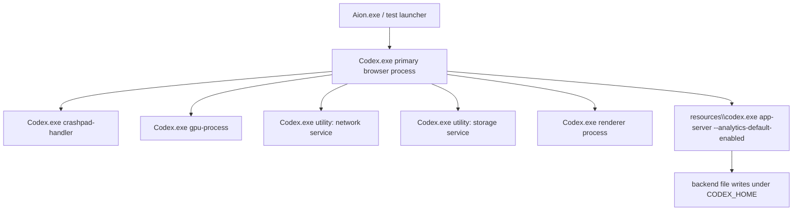
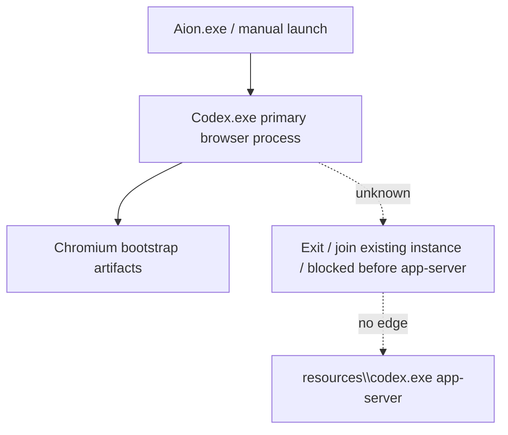

# Aion / Codex Process Graph

Date: 2026-06-29

Production code changes in this phase: none.

## Expected Successful Process Graph



## Successful Backend Indicators

The process graph is considered successful only when at least one of the following is proven:

- `resources\codex.exe app-server` exists.
- `config.toml` exists under `CODEX_HOME`.
- `state_*.sqlite` exists under `CODEX_HOME`.
- `.codex-global-state.json` exists under `CODEX_HOME`.

Chromium artifacts alone do not prove success.

## Failed Process Graph Candidate



The exact failed edge is still not proven. It must be one of:

- primary `Codex.exe` exits before backend import,
- `Codex.exe` remains alive but never attempts backend spawn,
- `resources\codex.exe app-server` starts and exits immediately,
- `resources\codex.exe app-server` starts under another parent,
- or backend process creation is blocked before visible process creation.

Current evidence supports the first category as most likely only because of Codex source control flow. It has not been captured in the latest user-failing run.

## Current Aion Launch Process

Current production source:

`C:\Users\WebVajhegan\Desktop\vs code\Aion\src-tauri\src\utils.rs`

Relevant path:

- `launch_isolated_codex_process(...)`
- `Command::new(executable)`
- `--user-data-dir=<profile>\Chromium`
- `CODEX_HOME=<profile>`
- `CODEX_ELECTRON_USER_DATA_PATH=<profile>\ElectronUserData`
- `stdout`, `stderr`, `stdin` set to null
- child process assigned to a Windows Job Object

No `APPDATA`, `LOCALAPPDATA`, `USERPROFILE`, or `HOME` overrides are currently applied by the launch path.

## Latest Controlled Process Status

The latest `AionFinalLock-20260629-221843` processes were not still running when checked:

```text
No Codex.exe / codex.exe process command line containing AionFinalLock-20260629-221843 was found.
```

The controlled run still produced backend artifacts for all four profile roots, so successful backend startup occurred before process cleanup.

## Missing Process Evidence

The final investigation still lacks a captured failed-process graph from the exact failing manual launch.

Needed evidence:

- primary `Codex.exe` PID,
- primary parent PID,
- primary exit code,
- all child creation events,
- `resources\codex.exe app-server` PID if spawned,
- app-server exit code if spawned,
- second-instance receiver PID if Electron forwards the launch.

Without those events, the exact failed process graph remains `UNKNOWN`.
