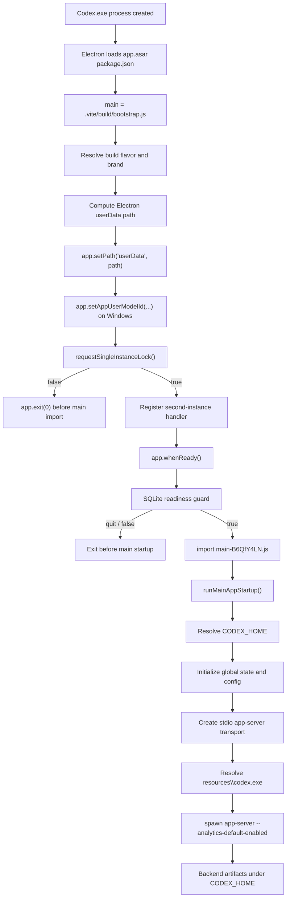

# Codex Desktop Startup Graph

Date: 2026-06-29

Production code changes in this phase: none.

Inspected package:

`C:\Program Files\WindowsApps\OpenAI.Codex_26.623.8305.0_x64__2p2nqsd0c76g0\app\resources\app.asar`

## High-Level Control Flow



## Pre-Lock Path Resolution

Function:

`bootstrap.js` function `C({ appDataPath, buildFlavor, env })`

Behavior:

1. Read `env.CODEX_ELECTRON_USER_DATA_PATH`.
2. If non-empty, use `path.resolve(value)`.
3. Otherwise use `path.join(appDataPath, displayNameForBuildFlavor)`.
4. For `agent` build flavor plus `CODEX_ELECTRON_AGENT_RUN_ID`, append `agent/<run-id>`.

Important negative evidence:

- This function does not read `--user-data-dir`.
- This function does not read `CODEX_HOME`.
- This function does not read `APPDATA`, `LOCALAPPDATA`, `USERPROFILE`, or `HOME` directly.

## Single-Instance Gate

Codex source:

`bootstrap.js`

Behavior:

- Packaged Windows builds call `requestSingleInstanceLock()`.
- If the call returns false, Codex exits before `main-B6QfY4LN.js` is imported.

Electron native source:

https://raw.githubusercontent.com/electron/electron/main/shell/browser/api/electron_api_app.cc

Relevant behavior:

- The native implementation obtains `chrome::DIR_USER_DATA`.
- It calls `Browser::Get()->RequestSingleInstanceLock(...)`.
- It returns false for `LOCK_ERROR`, `PROFILE_IN_USE`, or `PROCESS_NOTIFIED`.

This confirms the lock is a native Electron decision tied to the configured user-data directory concept, not a Codex backend decision.

## Main App Startup

File:

`main-B6QfY4LN.js`

Key function:

`runMainAppStartup()` (minified function `Lee`)

Responsibilities:

- await readiness,
- register app protocol,
- resolve `CODEX_HOME`,
- initialize global state,
- reconcile settings,
- construct local app-server transport,
- create the main window and service graph.

## Backend Startup

File:

`src-CoIhwwHr.js`

Relevant implementation:

- local stdio transport class,
- executable resolver for bundled `resources\codex.exe`,
- Node `child_process.spawn(...)`.

Expected command:

```text
resources\codex.exe app-server --analytics-default-enabled
```

## Authentication Locations

Authentication is not the earliest failure point for Chromium-only profiles.

Known path categories:

- `CODEX_HOME` controls backend storage and profile-local state.
- Electron `userData` controls Electron app-level data and native single-instance behavior.
- Chromium `--user-data-dir` controls Chromium browser profile data.

The failing profile class does not reach backend initialization. Therefore auth persistence is downstream of the current failure class.

## Verified Early Exits Before Backend

1. `requestSingleInstanceLock()` returns false.
2. SQLite readiness guard returns false or user selects quit.
3. Main import or startup throws.
4. macOS-only install/architecture flows, not relevant on Windows.

The only Windows early exit that cleanly matches the silent Chromium-only symptom is the single-instance lock branch. This remains a valid candidate, not a fully proven final root cause.

## Hidden Resource Investigation Status

The following are still not proven for the exact failing manual launch:

- named pipe object name,
- mutex object name,
- whether another process receives a second-instance event,
- whether `PROFILE_IN_USE` is returned,
- whether `PROCESS_NOTIFIED` is returned,
- whether MSIX package identity participates in the lock key,
- whether the Windows Job Object changes the native singleton outcome.

Those require targeted native process and IPC tracing during a reproduced failing launch.
