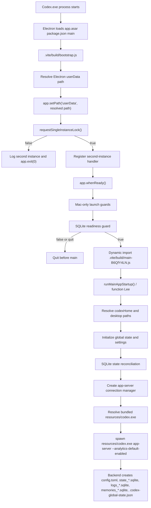

# Codex Desktop Startup Pipeline

Investigation target:

`C:\Program Files\WindowsApps\OpenAI.Codex_26.623.8305.0_x64__2p2nqsd0c76g0\app\resources\app.asar`

Package metadata:

- `app.asar!package.json`: `main` is `.vite/build/bootstrap.js`.
- `C:\Program Files\WindowsApps\OpenAI.Codex_26.623.8305.0_x64__2p2nqsd0c76g0\app\resources\owl-app.ini`: `UserDataDirectoryName=Codex`.

## Control Flow Graph

## Stages

### 1. Electron bootstrap entry

Source:

`app.asar!.vite/build/bootstrap.js:1`

Evidence:

- Offset `2491`: function `C({ appDataPath, buildFlavor, env })` resolves Electron `userData`.
- Offset `13377`: bootstrap calls `app.setPath('userData', C(...))`.
- Offset `13599`: bootstrap calls `app.requestSingleInstanceLock()`.
- Offset `13641`: failed lock logs `Exiting second desktop instance` and calls `app.exit(0)`.
- Offset `14114`: `runMainAppStartup` is imported only after the lock path succeeds.

Responsibility:

- Set product name and Electron `userData`.
- Acquire Electron's single-instance lock.
- Import the main desktop bundle only if startup guards succeed.

Inputs:

- `process.env.CODEX_ELECTRON_USER_DATA_PATH`
- `app.getPath("appData")`
- build flavor
- Electron package state

Outputs:

- Electron `userData` path
- single-instance lock ownership
- optional transition into main app startup

### 2. Electron `userData` resolution

Source:

`app.asar!.vite/build/bootstrap.js:1 @ offset 2491`

Evidence:

- If `CODEX_ELECTRON_USER_DATA_PATH` is set and non-empty, Codex resolves and uses it as Electron `userData`.
- Otherwise it uses `path.join(appDataPath, brand/build-flavor directory)`.
- `--user-data-dir` is not read in this function.
- `CODEX_HOME` is not read in this function.

Consequence:

Electron `userData` and Chromium `--user-data-dir` are separate startup concepts in Codex Desktop.

### 3. Single-instance gate

Source:

`app.asar!.vite/build/bootstrap.js:1 @ offsets 13377-14114`

Evidence:

- `app.setPath("userData", ...)` runs before `requestSingleInstanceLock()`.
- When the lock fails, bootstrap exits before loading `.vite/build/main-B6QfY4LN.js`.
- The `second-instance` handler exists only in the process that owns the lock.

Responsibility:

- Ensure one primary Electron instance per Electron `userData` namespace.
- Forward second-instance argv to the existing primary instance.

Possible early exit:

- `requestSingleInstanceLock()` returns false.

### 4. Main app startup

Source:

`app.asar!.vite/build/main-B6QfY4LN.js:1`

Evidence:

- Offset `1676262`: `function Lee()` is exported as `runMainAppStartup`.
- Offset `1677473`: startup logs `Launching app`.
- Offset `1678053`: startup resolves desktop config using `r.E({ moduleDir: __dirname })` and then calls `Yp(j.codexHome)`.

Responsibility:

- Initialize app services after bootstrap handoff.
- Resolve `codexHome`.
- Prepare global state and settings.
- Build window and app-server connection infrastructure.

Inputs:

- Electron app object.
- `process.env.CODEX_HOME`.
- bundled resources path.
- global state and settings files.

Outputs:

- Desktop runtime services.
- app-server connection manager.

### 5. Codex home and state path resolution

Source:

`app.asar!.vite/build/workspace-root-drop-handler-DeLi4ACJ.js:1`

Evidence:

- Offset `4305348`: `function qV({ moduleDir })` calls `t.Wr()` to resolve `codexHome`.
- Offset `4305564`: `.codex-global-state.json` is initialized under `codexHome`.
- Offset `4305822`: `qV` returns `{ codexHome, preloadPath, desktopRoot, repoRoot, globalState, settingsStore }`.
- `app.asar!.vite/build/src-CoIhwwHr.js:1 @ offset 332943`: `LT()` resolves `process.env.CODEX_HOME ?? path.join(os.homedir(), ".codex")`.

Responsibility:

- Bind backend state to `CODEX_HOME`.
- Initialize persistent desktop config files.

### 6. Backend app-server spawn

Source:

`app.asar!.vite/build/src-CoIhwwHr.js:1`

Evidence:

- Offset `576320`: class `PR` implements a stdio app-server transport.
- Offset `576703`: `FR(options)` resolves the executable and environment.
- Offset `578629`: `zR()` returns app-server args `app-server --analytics-default-enabled`.
- Offset `456251`: `rM(resourcesPath)` resolves bundled `codex.exe`.
- Offset `572678`: `NR.spawnProcess()` calls Node `child_process.spawn(...)`.

Responsibility:

- Locate the bundled `resources\codex.exe`.
- Spawn `resources\codex.exe app-server --analytics-default-enabled`.
- Maintain stdio transport to the backend.

Inputs:

- `resourcesPath`
- `repoRoot`
- `hostConfig`
- inherited environment with `CODEX_HOME`

Outputs:

- `resources\codex.exe app-server` process.
- backend artifacts under `CODEX_HOME`.

## Key Boundary

The backend cannot start unless execution reaches `runMainAppStartup()`.

The first gate that can prevent that transition on Windows is `requestSingleInstanceLock()`. If it returns false, Codex exits in `bootstrap.js` before the backend spawn code is imported.
