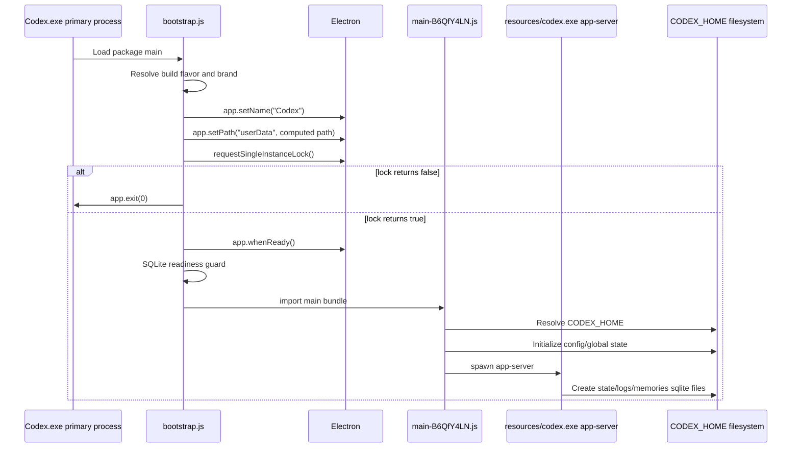
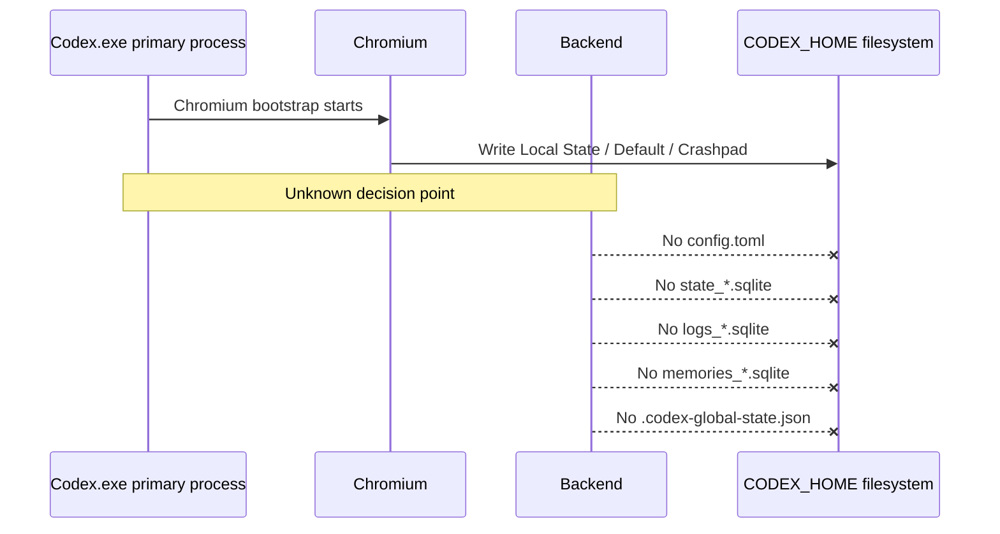

# Aion Timeline Final

Date: 2026-06-29

Production code changes in this phase: none.

## Source-Level Successful Startup Timeline

## Successful Artifact Timeline From Latest Controlled Run

Run root:

`C:\Users\WebVajhegan\CodexProfiles\AionFinalLock-20260629-221843-*`

### SameElectronUserData / P1

| Artifact | Creation time | Last write time | Meaning |
| --- | --- | --- | --- |
| `Chromium\Local State` | 2026-06-29 22:18:44 | 22:19:14 | Chromium bootstrap began |
| `sqlite\codex-dev.db` | 22:18:44 | 22:18:46 | backend/local sqlite path initialized |
| `state_5.sqlite` | 22:18:54 | 22:18:55 | backend started |
| `logs_2.sqlite` | 22:18:57 | 22:19:01 | backend logging active |
| `memories_1.sqlite` | 22:18:59 | 22:19:01 | backend persistent stores active |
| `.codex-global-state.json` | 22:19:14 | 22:19:14 | CODEX_HOME state active |
| `config.toml` | 22:19:14 | 22:19:20 | CODEX_HOME config active |

### SameElectronUserData / P2

| Artifact | Creation time | Last write time | Meaning |
| --- | --- | --- | --- |
| `Chromium\Local State` | 2026-06-29 22:18:49 | 22:19:18 | Chromium bootstrap began |
| `sqlite\codex-dev.db` | 22:18:49 | 22:18:55 | backend/local sqlite path initialized |
| `state_5.sqlite` | 22:19:04 | 22:19:05 | backend started |
| `logs_2.sqlite` | 22:19:05 | 22:19:08 | backend logging active |
| `memories_1.sqlite` | 22:19:07 | 22:19:07 | backend persistent stores active |
| `.codex-global-state.json` | 22:19:31 | 22:19:31 | CODEX_HOME state active |
| `config.toml` | 22:19:30 | 22:19:42 | CODEX_HOME config active |

Observation:

Both profiles succeeded even though they shared a single `SharedElectronUserData` directory. This contradicts a simple "shared Electron userData always blocks the second profile" model.

### DifferentElectronUserData / P1

| Artifact | Creation time | Last write time | Meaning |
| --- | --- | --- | --- |
| `ElectronUserData` | 2026-06-29 22:18:51 | 22:18:51 | unique Electron path created |
| `Chromium\Local State` | 22:18:52 | 22:19:22 | Chromium bootstrap began |
| `sqlite\codex-dev.db` | 22:18:52 | 22:19:00 | backend/local sqlite path initialized |
| `state_5.sqlite` | 22:19:11 | 22:19:11 | backend started |
| `logs_2.sqlite` | 22:19:11 | 22:19:12 | backend logging active |
| `.codex-global-state.json` | 22:19:27 | 22:19:27 | CODEX_HOME state active |
| `config.toml` | 22:19:26 | 22:19:38 | CODEX_HOME config active |

### DifferentElectronUserData / P2

| Artifact | Creation time | Last write time | Meaning |
| --- | --- | --- | --- |
| `ElectronUserData` | 2026-06-29 22:18:54 | 22:18:54 | unique Electron path created |
| `Chromium\Local State` | 22:18:55 | 22:19:31 | Chromium bootstrap began |
| `sqlite\codex-dev.db` | 22:18:55 | 22:19:03 | backend/local sqlite path initialized |
| `state_5.sqlite` | 22:19:15 | 22:19:15 | backend started |
| `logs_2.sqlite` | 22:19:15 | 22:19:17 | backend logging active |
| `.codex-global-state.json` | 22:19:30 | 22:19:31 | CODEX_HOME state active |
| `config.toml` | 22:19:31 | 22:19:41 | CODEX_HOME config active |

## Failed Timeline

The exact failed timeline remains UNKNOWN because the latest controlled run did not reproduce a failed launch.

Known failed-profile pattern from previous observations:

## First Proven Divergence

The first proven source-level divergence is:

`requestSingleInstanceLock()` returning `false` versus `true`.

But the first observed divergence in the actual user-failing manual launch is still `UNKNOWN`, because no failed launch in the latest controlled run captured:

- primary `Codex.exe` exit code,
- app-server process creation absence,
- second-instance event delivery,
- or native Electron lock result.

## Required Next Capture

To complete this timeline, the next run must capture millisecond process events for an actual failed manual launch:

1. `Codex.exe` creation time.
2. `Codex.exe` exit time and exit code.
3. Every child process creation.
4. Whether `resources\codex.exe app-server` is spawned.
5. First backend artifact timestamp.
6. Native lock branch outcome if instrumented.
